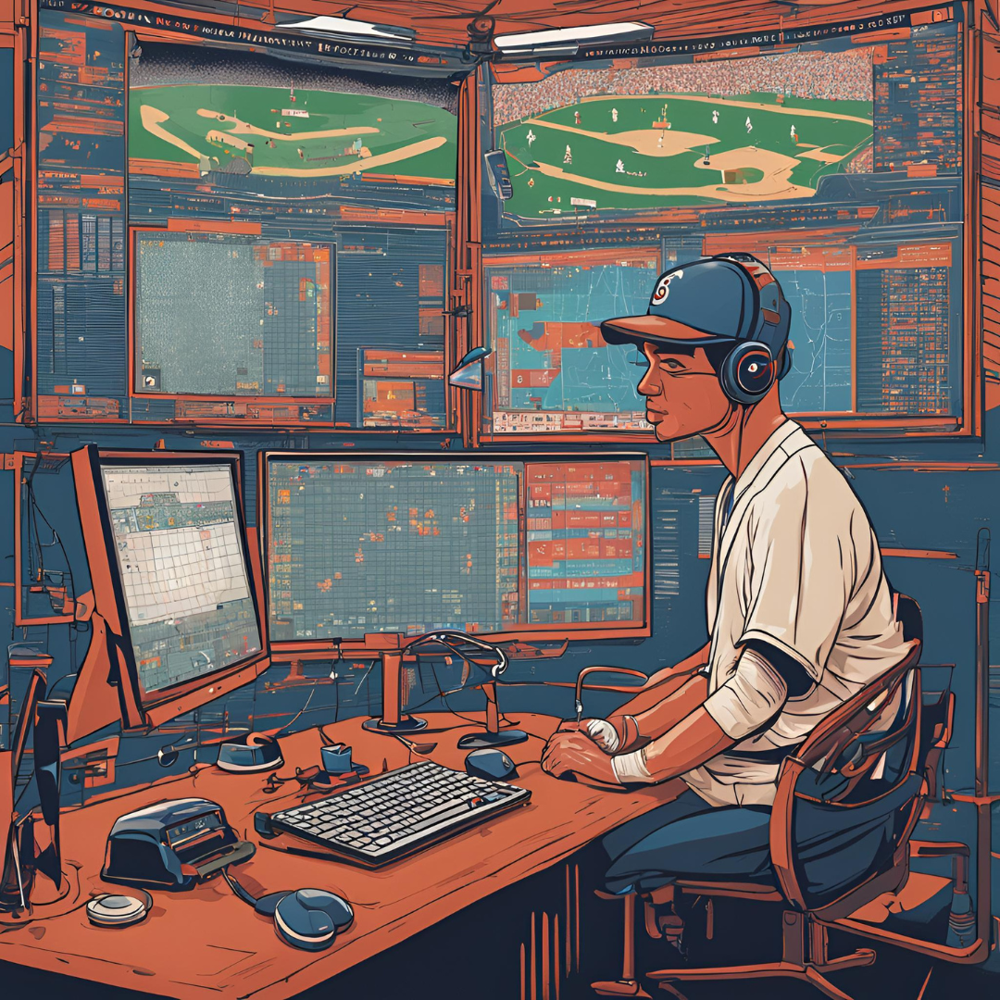

<!-- Improved compatibility of back to top link: See: https://github.com/othneildrew/Best-README-Template/pull/73 -->

<!--
*** Thanks for checking out the Best-README-Template. If you have a suggestion
*** that would make this better, please fork the repo and create a pull request
*** or simply open an issue with the tag "enhancement".
*** Don't forget to give the project a star!
*** Thanks again! Now go create something AMAZING! :D
-->

<!-- PROJECT SHIELDS -->
<!--
*** I'm using markdown "reference style" links for readability.
*** Reference links are enclosed in brackets [ ] instead of parentheses ( ).
*** See the bottom of this document for the declaration of the reference variables
*** for contributors-url, forks-url, etc. This is an optional, concise syntax you may use.
*** https://www.markdownguide.org/basic-syntax/#reference-style-links

<!-- PROJECT LOGO -->
 

  

  <h3 align="center">Billy</h3>

  

    ⚾ Minor to Major League Forecaster ⚾
     
    <a href="https://github.com/syanification/Billy"><strong>Explore the docs »</strong></a>
     
   <strong><s>Visit the Site! »</s> Sorry, Website is Down!</strong>
     
     
    <a href="https://youtu.be/dB1BBQ7oqvg?si=fXOmFDEUcb_NOgSN">View Demo</a>
    &middot;
    <a href="https://github.com/syanification/Billy/issues/new?labels=bug&template=bug-report---.md">Report Bug</a>
    &middot;
    <a href="https://github.com/syanification/Billy/issues/new?labels=enhancement&template=feature-request---.md">Request Feature</a>
  

<!-- TABLE OF CONTENTS -->

  
Table of Contents

  <ol>
    <li>
      <a href="#about-the-project">About The Project</a>
      <ul>
        <li><a href="#built-with">Built With</a></li>
      </ul>
    </li>
    <li><a href="#license">License</a></li>
    <li><a href="#contact">Contact</a></li>
    <li><a href="#acknowledgments">Acknowledgments</a></li>
  </ol>

<!-- ABOUT THE PROJECT -->
## About The Project

[![Product Name Screen Shot][product-screenshot]](https://github.com/syanification/Billy)

### Inspiration
I have a few passions, but at the top of my list are Machine Learning and Baseball. So when I saw this hackathon pop up with the prospecting challenge, I knew exactly what I was going to do. I was going to try and predict the future.

### What it does
Billy feeds in all of the major and minor league data I could get ahold of from baseball reference and uses it to train a machine learning model to predict how a minor leaguer will perform in the bigs.

### How we built it
First I started in R to get the baseball reference data for the majors and minors. Then it was off to the Google Vertex Workstation to create the model to learn from the data. After that was complete the process of deploying and endpoint to that model began. Finally once everything was set up I could focus on creating and hosting a webpage to access predictions from the model!

### Challenges we ran into
Web development is not my bread and butter so there was a lot of throwing my head against the wall attempting to get everything to integrate cleanly together. I also had to rapidly learn how to host a server and had a few incredibly late nights near the end.

### What we learned
I truly believe that every part of this project was an immensely helpful learning experience, I had never used almost any of the tools other than tensorflow before and it opened my eyes to so many great platforms and frameworks that will become regular parts of my workflow.

### What's next for ⚾ Billy - Minor to Major League Forecaster ⚾
Next steps is to conglomerate as much data as possible to try and get even more accurate predictions. Perhaps working in conjunction with the MLB could make this possible!

(<a href="#readme-top">back to top</a>)

### Built With

This section should list any major frameworks/libraries used to bootstrap your project. Leave any add-ons/plugins for the acknowledgements section. Here are a few examples.

- R
- Python
- JS
- Google Vertex
- Heroku
- Tensorflow

(<a href="#readme-top">back to top</a>)

<!-- USAGE EXAMPLES -->
## Usage

Simply [visit the hosted webpage](https://billy-forecaster-35cf250c0967.herokuapp.com/) and type in BA, OBP, & SLG statistics and peer into the future!

(<a href="#readme-top">back to top</a>)

<!-- LICENSE -->
## License

Distributed under the MIT License. See `LICENSE` for more information.

(<a href="#readme-top">back to top</a>)

<!-- CONTACT -->
## Contact

Riley Roberts - [Linkedin](https://www.linkedin.com/in/riley-roberts-26648a232/)

Project Link: [https://github.com/syanification/Billy](https://github.com/your_username/repo_name)

(<a href="#readme-top">back to top</a>)

<!-- ACKNOWLEDGMENTS -->
## Acknowledgments

This project would NOT have been possible without these fantastic resources so check them out!

* [Choose an Open Source License](https://choosealicense.com)
* [Best README Template](https://github.com/othneildrew/Best-README-Template/blob/main/README.md?plain=1)
* [Heroku Website Hosting](https://www.heroku.com/home)
* [CSS-Generators](https://css-generators.com/)

(<a href="#readme-top">back to top</a>)

<!-- MARKDOWN LINKS & IMAGES -->
<!-- https://www.markdownguide.org/basic-syntax/#reference-style-links -->
[product-screenshot]: Images/website_blank.png